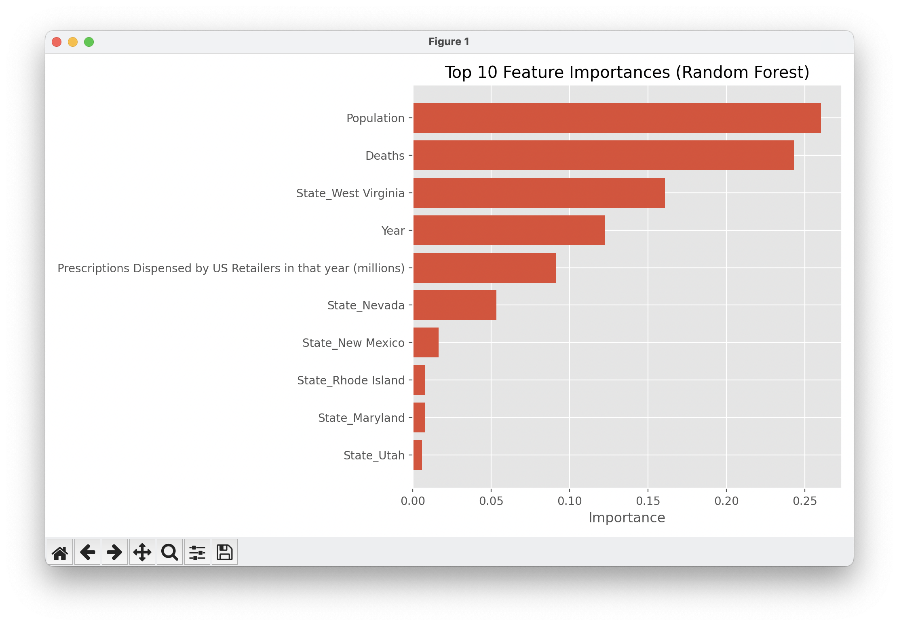

# US Opioid Overdose Death Rate Prediction

This project analyzes opioid overdose data in the United States and builds
machine learning models to predict the **Crude Overdose Death Rate** based on
demographic, temporal, and prescription-related features.

---

## 📊 Dataset

**Source:**  
[Kaggle – US Opioid Overdose Deaths](https://www.kaggle.com/datasets/thedevastator/us-opioid-overdose-deaths)

**Features Used:**
- `Year` – the year of the data
- `Population` – population of the state
- `Deaths` – number of opioid overdose deaths
- `Prescriptions Dispensed` – prescription volume in millions
- `State` – state information (One-Hot Encoded)

**Target Variable:**
- `Crude Rate` – deaths per 100,000 population

---

## 🧠 Models Used

Regression models trained and compared:

- **Linear Regression**
- **Decision Tree Regressor**
- **Random Forest Regressor**
- **Gradient Boosting Regressor**
- **Support Vector Regression (SVR)**
- **K-Nearest Neighbors (KNN)**

---

## 📈 Model Evaluation

Evaluation metrics:

- **MAE** – Mean Absolute Error
- **RMSE** – Root Mean Squared Error
- **R² Score**
- **Accuracy (%)** = R² × 100

**Best Performing Model:**  
**Random Forest Regressor** with ~97% R² accuracy

---

## 🔍 Feature Importance

For tree-based models, feature importance was extracted.  
**Top contributing features include:**
1. `Population`
2. `Deaths`
3. `Year`
4. Certain states (e.g., `West Virginia`)

---

## 📉 Visualizations


  

  

---

## 🚀 How to Run

1. Clone the repository:

```bash
git clone https://github.com/USERNAME/US_Opioid_Overdose_Deaths_ml.git
cd US_Opioid_Overdose_Deaths_ml
